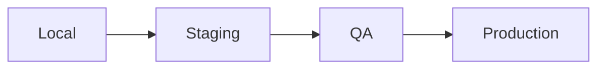
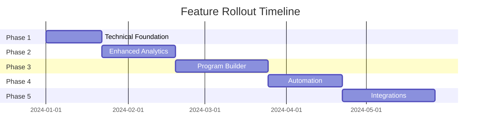

# CTO Project Overview - Stripe Coach Platform

## 🚨 Critical Issues

1. **Authentication System**
```log
Error: ENOENT: no such file or directory
Path: /app/api/auth/[...nextauth]/route.js
Status: BLOCKING DEPLOYMENT
```

2. **Component Errors**
```log
- Missing react-quill module
- AuthNav import errors
- Client profile page syntax errors
- Template Builder V3 frequency selection not working
```

3. **Build Process**
```log
- Webpack caching errors with incorrect header checks
- Module resolution issues with firebase/firestore
- Static path generation failures
- ResolverCachePlugin restoration failures
```

## 🎯 MVP Status

### Core Features Status
| Feature | Status | Priority |
|---------|--------|----------|
| Authentication | 🔴 Broken | P0 |
| Client Management | 🟡 Partial | P1 |
| Progress Tracking | 🟢 Working | P2 |
| Check-in System | 🟢 Working | P2 |
| Coach Dashboard | 🟡 Partial | P1 |

### Technical Debt
1. Form validation needs improvement
2. Error handling requires standardization
3. Cache system implementation required
4. Testing coverage needs expansion
5. Template Builder V3 frequency selection needs fixing
6. Webpack caching system needs optimization

## 🛠 Immediate Action Plan (2 Weeks)

### Week 1: Core Infrastructure
1. **Day 1-2: Authentication Fix**
   - Implement NextAuth route
   - Fix session management
   - Set up role-based access

2. **Day 3-4: Critical Bugs**
   - Fix client profile syntax errors
   - Resolve module dependencies
   - Address webpack caching
   - Fix Template Builder V3 frequency selection

3. **Day 5: Testing Infrastructure**
   - Set up Jest configuration
   - Implement basic test suite
   - Add CI pipeline

### Week 2: MVP Completion
1. **Day 1-2: Core Features**
   - Complete client management
   - Finish coach dashboard
   - Implement error handling

2. **Day 3-4: User Experience**
   - Mobile responsiveness
   - Loading states
   - Error messages

3. **Day 5: QA & Documentation**
   - User acceptance testing
   - Documentation update
   - Deployment preparation

## 📊 Success Metrics

### Technical Metrics
- Page load time < 2s
- API response time < 200ms
- Test coverage > 80%
- Zero critical security issues

### User Metrics
- Successful user registration
- Check-in completion rate
- Progress tracking usage
- Coach engagement rate

## 🔒 Security Priorities

1. **Authentication**
   - Secure session management
   - Role-based access control
   - Password reset functionality

2. **Data Protection**
   - Progress photo encryption
   - Personal data security
   - Audit logging

## 📱 Development Workflow

### Branch Strategy
```
main (production)
└── staging
    ├── feature/auth-fix
    ├── feature/client-profile
    └── feature/error-handling
```

### Deployment Pipeline


## 🚀 Launch Requirements

### Pre-Launch Checklist
- [ ] Authentication system working
- [ ] Core features completed
- [ ] Mobile responsive
- [ ] Error handling implemented
- [ ] Basic analytics setup

### Post-Launch Monitoring
- [ ] Error tracking
- [ ] Performance monitoring
- [ ] User feedback collection
- [ ] Usage analytics

## 📅 Future Roadmap

### Phase 2 (Post-MVP)
1. Advanced Analytics
   - Progress comparisons
   - Goal tracking
   - Performance metrics

2. Enhanced Features
   - Automated notifications
   - Advanced program builder
   - Resource library

3. Integration Features
   - Calendar sync
   - Nutrition tracking
   - Fitness device integration

## 🆕 Updated Roadmap 2024

### Phase 1: Technical Foundation (2-3 Weeks)
#### Performance & Infrastructure
| Feature | Priority | Complexity | Status |
|---------|----------|------------|---------|
| Cache System Implementation | P0 | High | Pending |
| Test Coverage Expansion | P0 | Medium | In Progress |
| Form Validation Standardization | P1 | Medium | Pending |
| Error Handling Standardization | P1 | Medium | Pending |

#### Success Criteria
- Cache hit rate > 80%
- Test coverage > 80%
- Form error rate < 2%
- API response time < 150ms

### Phase 2: Enhanced Analytics (3-4 Weeks)
#### Features
| Feature | Priority | Complexity | Status |
|---------|----------|------------|---------|
| Client Progress Analytics | P1 | High | In Progress |
| Coach Performance Metrics | P1 | High | Pending |
| Revenue & Business Analytics | P2 | Medium | Planned |
| Custom Report Builder | P2 | Medium | Planned |

#### Success Criteria
- Real-time analytics dashboard
- Custom report generation
- Data visualization components
- Export functionality

### Phase 3: Program Builder Evolution (4-5 Weeks)
#### Features
| Feature | Priority | Complexity | Status |
|---------|----------|------------|---------|
| Advanced Program Templates | P1 | High | In Progress - Template Builder V3 implemented with scheduling |
| Template Builder V3 | P0 | High | In Progress - UI implemented, debugging needed |
| Dynamic Program Adaptation | P1 | High | Planned |
| Resource Library | P2 | Medium | Planned |
| Program Analytics | P2 | Medium | Planned |

#### Recent Updates (Last Sprint)
- Implemented Template Builder V3 with modern UI/UX
- Added comprehensive check-in schedule configuration:
  - Multiple frequency options (daily, weekly, fortnightly, monthly, custom)
  - Multi-day window support for check-ins
  - Flexible scheduling with custom options
  - Time-based opening and closing windows
- Known Issues:
  - Frequency selection interaction not working
  - Webpack caching errors affecting development
  - Firebase/Firestore module resolution issues

#### Next Sprint Focus
- Fix frequency selection in Template Builder V3
- Resolve Webpack caching issues
- Implement proper error handling for form submissions
- Add validation for schedule configuration
- Improve mobile responsiveness

#### Success Criteria
- Template creation time reduced by 50%
- Program completion rate > 75%
- Resource usage metrics
- Automated program adjustments
- Zero UI interaction bugs
- Successful schedule configuration saves

### Phase 4: Automation & Notifications (3-4 Weeks)
#### Features
| Feature | Priority | Complexity | Status |
|---------|----------|------------|---------|
| Smart Notifications System | P1 | Medium | Planned |
| Automated Check-in Reminders | P1 | Low | Planned |
| Progress Milestone Alerts | P2 | Medium | Planned |
| Custom Notification Rules | P2 | Medium | Planned |

#### Success Criteria
- Notification engagement rate > 60%
- Check-in completion rate > 80%
- Custom rule creation interface
- Multi-channel delivery (email, push, in-app)

### Phase 5: Integrations (4-5 Weeks)
#### Features
| Feature | Priority | Complexity | Status |
|---------|----------|------------|---------|
| Calendar Integration | P1 | Medium | Planned |
| Nutrition Tracking | P1 | High | Planned |
| Fitness Device Integration | P2 | High | Planned |
| Data Import/Export Tools | P2 | Medium | Planned |

#### Success Criteria
- Successful sync rate > 95%
- Data accuracy > 98%
- User integration rate > 50%
- API reliability > 99.9%

### Technical Debt & Maintenance
#### Ongoing Tasks
| Task | Frequency | Priority |
|------|-----------|----------|
| Performance Monitoring | Daily | P0 |
| Security Audits | Weekly | P0 |
| Dependency Updates | Monthly | P1 |
| Code Quality Reviews | Bi-weekly | P1 |

### Risk Management
#### Key Risks & Mitigation
1. **Data Integration**
   - Implement robust error handling
   - Data validation layers
   - Fallback mechanisms

2. **Performance**
   - Regular load testing
   - Performance benchmarking
   - Optimization sprints

3. **User Adoption**
   - Beta testing program
   - Feature flagging
   - Gradual rollout

### Timeline Overview


### Success Metrics
#### Technical
- System uptime > 99.9%
- API response time < 200ms
- Mobile load time < 2s
- Error rate < 0.1%

#### Business
- User retention > 85%
- Feature adoption > 70%
- Support tickets < 50/week
- Customer satisfaction > 90%

### Resource Requirements
#### Development Team
- 2 Frontend Developers
- 2 Backend Developers
- 1 DevOps Engineer
- 1 QA Engineer

#### Infrastructure
- Expanded cloud resources
- Additional testing environments
- Monitoring tools
- Analytics platform

## 👥 Team Structure

### Current Needs
1. Frontend Developer
   - React/Next.js expertise
   - Mobile-first development
   - UI/UX implementation

2. Backend Developer
   - API development
   - Database optimization
   - Security implementation

3. QA Engineer
   - Test automation
   - Performance testing
   - Security testing

## 📝 Documentation Requirements

1. Technical Documentation
   - API documentation
   - Component library
   - Database schema

2. User Documentation
   - Coach guide
   - Client guide
   - Admin guide

## ⚠️ Risk Management

### Technical Risks
1. Authentication system stability
2. Data security
3. Performance at scale

### Mitigation Strategies
1. Comprehensive testing
2. Regular security audits
3. Performance monitoring
4. Backup systems

## 🔄 Regular Maintenance

### Daily Tasks
- Monitor error logs
- Check system health
- Review security alerts

### Weekly Tasks
- Performance review
- Security scan
- Backup verification

### Monthly Tasks
- System updates
- Security patches
- Performance optimization 