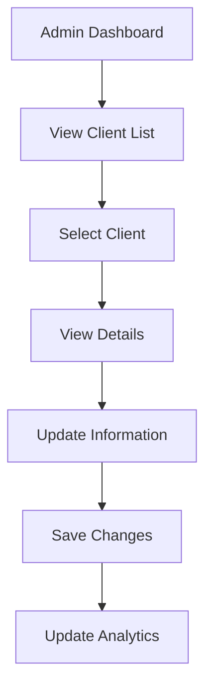
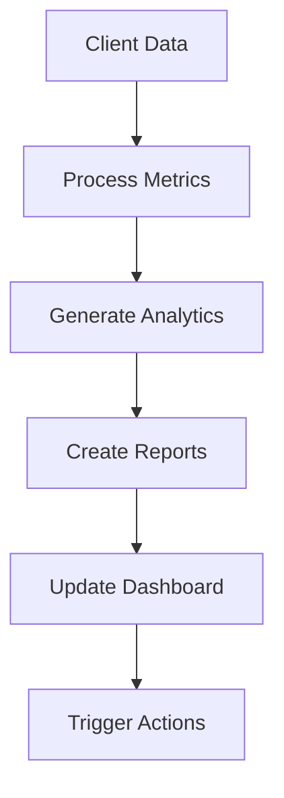

# Admin-Client Interaction Documentation

## Overview
This document outlines the data flows and interactions between administrators and clients in the Stripe Coach platform, including data structures, features, and implementation status.

## Data Structures

### Client Management
```typescript
interface ClientManagement {
  id: string;
  firstName: string;
  lastName: string;
  email: string;
  phone: string;
  coachId: string;
  status: 'active' | 'pending' | 'inactive';
  subscription: {
    plan: string;
    status: 'active' | 'cancelled' | 'expired';
    startDate: Date;
    endDate: Date;
    autoRenew: boolean;
  };
  metrics: {
    checkIns: number;
    totalSessions: number;
    consistency: number;
    daysStreak: number;
    lastCheckIn?: Date;
    completionRate: number;
  };
  billing: {
    totalPaid: number;
    lastPayment: Date;
    nextPayment: Date;
    paymentMethod: string;
  };
}
```

### Client Analytics
```typescript
interface ClientAnalytics {
  clientId: string;
  engagement: {
    weeklyActive: boolean;
    checkInCompletion: number;
    photoSubmissionRate: number;
    feedbackResponseRate: number;
  };
  progress: {
    weightChange: number;
    measurements: Record<string, number>;
    goalCompletion: number;
    programAdherence: number;
  };
  financial: {
    lifetimeValue: number;
    subscriptionValue: number;
    churnRisk: number;
    upsellPotential: number;
  };
  coach: {
    coachId: string;
    coachName: string;
    coachRating: number;
    responseTime: number;
  };
}
```

## Feature Implementation Status

### 1. Client Management
#### Profile Management
- ✅ View client details
- ✅ Update client information
- ✅ Assign/change coach
- ✅ Manage subscription
- ❌ Bulk client operations

#### Client Support
- ✅ Account recovery
- ✅ Support tickets
- ❌ Mass communications
- ✅ Profile transfers
- 🚧 Dispute handling

### 2. Analytics & Reporting
#### Client Analytics
- ✅ Basic metrics tracking
- ✅ Progress visualization
- 🚧 Advanced analytics
- ❌ Custom reports
- ❌ Export functionality

#### Financial Analytics
- ❌ Revenue tracking
- ❌ Payment history
- ❌ Subscription analytics
- ❌ Churn analysis
- ❌ Revenue forecasting

### 3. Communication System
#### Direct Communication
- ✅ Support messaging
- ✅ File sharing
- ❌ Mass notifications
- ❌ Email templates
- ❌ SMS integration

#### Automated Communications
- ❌ Welcome sequences
- ❌ Reminder emails
- ❌ Progress reports
- ❌ Payment notifications
- ❌ Re-engagement campaigns

### 4. Security & Compliance
#### Data Protection
- ✅ Basic encryption
- ✅ Access controls
- 🚧 Audit logging
- ❌ GDPR compliance
- ❌ Data retention

#### Privacy Management
- ✅ Basic privacy controls
- ❌ Privacy policy
- ❌ Terms of service
- ❌ Data export
- ❌ Data deletion

### 5. Billing & Payments
#### Payment Processing
- ❌ Payment processing
- ❌ Subscription management
- ❌ Invoice generation
- ❌ Payment history
- ❌ Refund processing

#### Financial Management
- ❌ Revenue tracking
- ❌ Financial reports
- ❌ Tax reporting
- ❌ Payout management
- ❌ Refund handling

## Data Flow Diagrams

### Client Management Flow


### Analytics Flow


## Implementation Gaps

### 1. Missing Financial Features
- Payment processing
- Subscription management
- Invoice generation
- Payment history
- Refund processing

### 2. Incomplete Analytics
- Advanced analytics
- Custom reports
- Export functionality
- Financial tracking
- Performance optimization

### 3. Limited Automation
- Mass communications
- Automated reports
- Payment notifications
- Re-engagement campaigns
- Welcome sequences

## Future Enhancements

### 1. Financial Features
- Implement payment processing
- Add subscription management
- Create invoice generation
- Develop payment history
- Add refund processing

### 2. Analytics Improvements
- Add advanced analytics
- Create custom reports
- Implement export functionality
- Add financial tracking
- Optimize performance

### 3. Automation Features
- Implement mass communications
- Add automated reports
- Create payment notifications
- Develop re-engagement campaigns
- Add welcome sequences

## Legend
✅ - Implemented and functional
🚧 - Partially implemented/In progress
❌ - Not started/Planned 