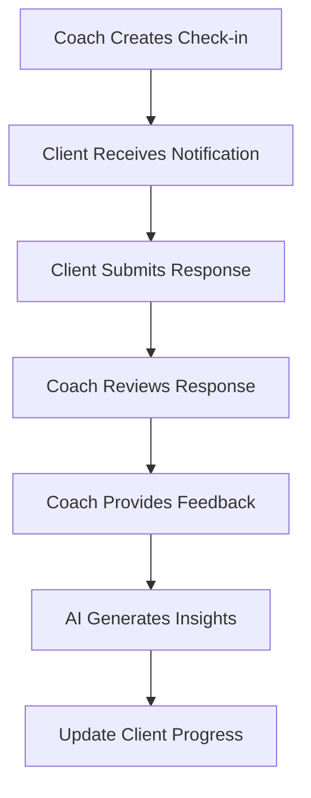
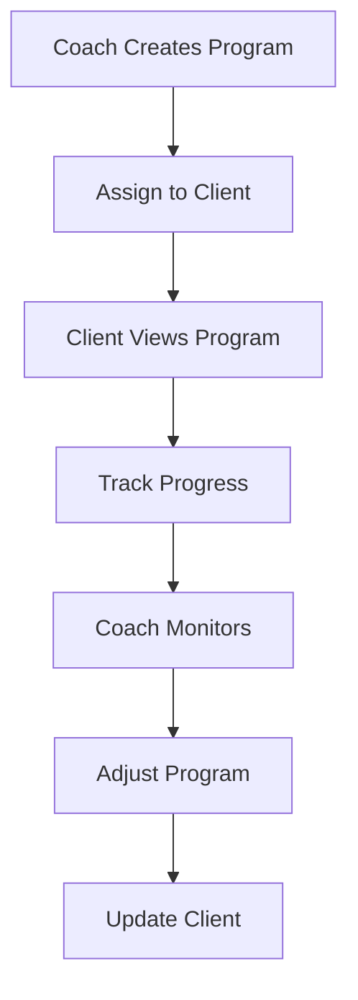

# Coach-Client Interaction Documentation

## Overview
This document outlines the data flows and interactions between coaches and clients in the Stripe Coach platform, including data structures, features, and implementation status.

## Data Structures

### Client Profile
```typescript
interface ClientProfile {
  id: string;
  coachId: string;
  firstName: string;
  lastName: string;
  email: string;
  phone: string;
  startDate: string;
  notes: string;
  status: 'pending' | 'active' | 'inactive';
  metrics: {
    checkIns: number;
    totalSessions: number;
    consistency: number;
    daysStreak: number;
    lastCheckIn?: Date;
    completionRate: number;
  };
  program: {
    type?: string;
    currentWeek: number;
    totalWeeks: number;
    phase: string;
  };
}
```

### Check-in System
```typescript
interface CheckInForm {
  id: string;
  templateId: string;
  clientId: string;
  title: string;
  description: string;
  questions: Question[];
  answers: CheckInAnswer[];
  metrics: CheckInMetrics;
  status: CheckInStatus;
  photos?: CheckInPhoto[];
  coachFeedback?: {
    comment: string;
    suggestions: string[];
    rating?: number;
    reviewedAt: string;
  };
  aiInsights?: {
    summary: string;
    recommendations: string[];
    trends: {
      metric: keyof CheckInMetrics;
      trend: 'up' | 'down' | 'stable';
      change: number;
    }[];
  };
}
```

## Feature Implementation Status

### 1. Client Profile & Program Management
- ✅ Basic profile creation
- ✅ Program assignment
- ✅ Progress tracking
- 🚧 Advanced metrics
- ❌ Custom program builder

### 2. Check-in System
#### Check-in Creation
- ✅ Coach creates check-in templates
- ✅ Schedule regular check-ins
- ✅ Custom check-in questions
- ❌ Automated check-in reminders

#### Check-in Response Flow
- ✅ Client submits check-in responses
- ✅ Photo upload with check-ins
- ✅ Coach reviews responses
- ✅ Coach provides feedback
- ❌ Automated progress tracking

### 3. Progress Tracking
#### Metrics Collection
- ✅ Weight tracking
- ✅ Body measurements
- ✅ Progress photos
- ❌ Custom metric creation

#### Progress Analysis
- ✅ Progress visualization
- ✅ Trend analysis
- ❌ Comparative analytics
- ❌ Progress reports generation

### 4. Communication System
#### Direct Communication
- ✅ Direct messaging
- ✅ File sharing
- ❌ Voice messages
- ❌ Group messaging

#### Notifications
- ❌ Email notifications
- ❌ Push notifications
- ❌ SMS alerts
- ❌ Notification preferences

### 5. Program Management
#### Program Creation
- ❌ Program templates
- ❌ Custom program builder
- ❌ Program scheduling
- ❌ Resource attachment

#### Program Delivery
- ❌ Content delivery system
- ✅ Progress tracking
- ❌ Resource access
- ❌ Program adjustments

### 6. AI Integration
#### Progress Analysis
- ✅ Data validation
- 🚧 Trend analysis
- ✅ Progress tracking
- 🚧 Goal assessment

#### Report Generation
- 🚧 Progress summaries
- 🚧 Performance insights
- 🚧 Goal recommendations
- 🚧 Trend analysis

## Data Flow Diagrams

### Check-in Flow


### Program Management Flow


## Implementation Gaps

### 1. Missing Automated Features
- Check-in reminders
- Progress notifications
- Goal milestone alerts
- Automated reports

### 2. Incomplete Program Management
- Program templates
- Resource library
- Content delivery
- Program adjustments

### 3. Limited Analytics
- Comparative analytics
- Custom reports
- Advanced metrics
- Performance optimization

## Future Enhancements

### 1. Automated Features
- Implement check-in reminders
- Add progress notifications
- Create goal milestone alerts
- Develop automated reports

### 2. Program Management
- Build program templates
- Create resource library
- Implement content delivery
- Add program adjustment tools

### 3. Analytics Improvements
- Add comparative analytics
- Create custom reports
- Implement advanced metrics
- Optimize performance tracking

## Legend
✅ - Implemented and functional
🚧 - Partially implemented/In progress
❌ - Not started/Planned 