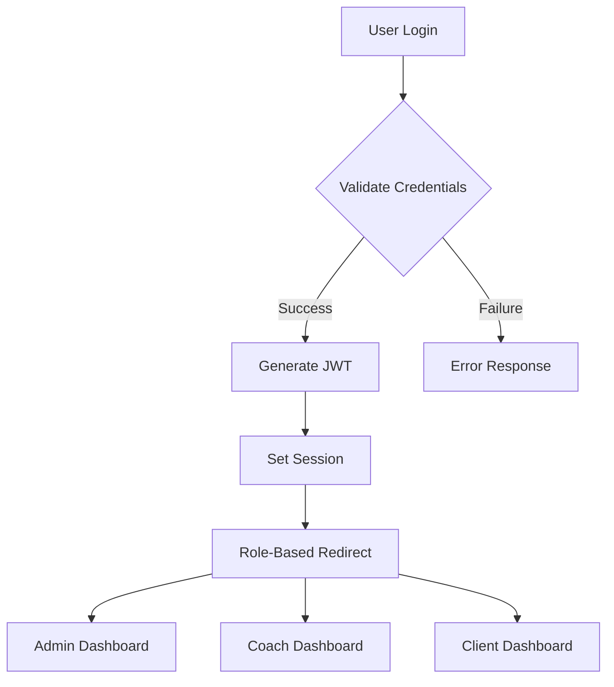
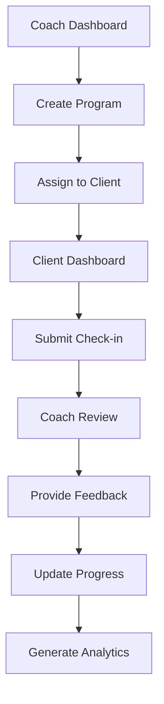

# Stripe Coach Platform Data Flow Documentation

## Overview
This document outlines the data flows and interactions between different roles (Admin, Coach, Client) and system components in the Stripe Coach platform.

## Role-Based Access Control

### Admin Access
- ✅ Full system access
- ✅ Coach management
- ✅ Client oversight
- 🚧 Analytics and reporting
- 🚧 System configuration

### Coach Access
- ✅ Own profile management
- ✅ Assigned clients only
- 🚧 Program management
- ✅ Client progress tracking
- ✅ Communication with clients

### Client Access
- ✅ Own profile and data
- ✅ Assigned coach communication
- 🚧 Program access
- ✅ Progress tracking
- ✅ Check-in submission

## Data Flow Diagrams

### Authentication Flow

### Coach-Client Interaction Flow

## Data Collection Points

### Admin Data Collection
1. **Coach Management**
   - ✅ Coach profiles
   - 🚧 Performance metrics
   - ✅ Client assignments
   - ❌ Revenue data

2. **System Analytics**
   - 🚧 Platform usage
   - ❌ Revenue tracking
   - 🚧 Client retention
   - 🚧 Coach performance

### Coach Data Collection
1. **Client Management**
   - ✅ Client profiles
   - ✅ Progress tracking
   - ✅ Goal setting
   - ✅ Check-in reviews

2. **Program Management**
   - 🚧 Workout programs
   - 🚧 Session scheduling
   - 🚧 Resource allocation
   - ✅ Progress assessment

### Client Data Collection
1. **Progress Tracking**
   - ✅ Check-in submissions
   - ✅ Measurements
   - ✅ Photos
   - ✅ Goal progress

2. **Communication**
   - ✅ Messages
   - ✅ File uploads
   - 🚧 Schedule requests
   - ✅ Feedback

## Form Handling

### Admin Forms
1. **Coach Management**
   - ✅ Coach creation/editing
   - ✅ Client assignment
   - 🚧 Performance review
   - 🚧 Analytics configuration

2. **System Configuration**
   - 🚧 Program templates
   - ✅ Check-in templates
   - 🚧 Notification settings
   - 🚧 Security settings

### Coach Forms
1. **Client Management**
   - ✅ Client profile creation
   - ✅ Program assignment
   - ✅ Goal setting
   - ✅ Progress tracking

2. **Program Management**
   - 🚧 Workout creation
   - 🚧 Session scheduling
   - 🚧 Resource management
   - ✅ Progress assessment

### Client Forms
1. **Check-in Forms**
   - ✅ Progress updates
   - ✅ Measurement tracking
   - ✅ Photo uploads
   - ✅ Goal progress

2. **Profile Forms**
   - ✅ Personal information
   - 🚧 Preferences
   - ✅ Goals
   - 🚧 Communication settings

## AI Integration Points

### Progress Analysis
1. **Check-in Processing**
   - ✅ Data validation
   - 🚧 Trend analysis
   - ✅ Progress tracking
   - 🚧 Goal assessment

2. **Report Generation**
   - 🚧 Progress summaries
   - 🚧 Performance insights
   - 🚧 Goal recommendations
   - 🚧 Trend analysis

### Automated Features
1. **Notifications**
   - ❌ Check-in reminders
   - 🚧 Progress updates
   - ❌ Goal milestones
   - 🚧 System alerts

2. **Analytics**
   - 🚧 Performance metrics
   - ✅ Progress tracking
   - 🚧 Goal achievement
   - 🚧 Client engagement

## Data Storage & Security

### Database Collections
1. **Users**
   - ✅ Admin profiles
   - ✅ Coach profiles
   - ✅ Client profiles
   - ✅ Authentication data

2. **Programs**
   - 🚧 Workout templates
   - 🚧 Client programs
   - ✅ Progress tracking
   - 🚧 Resource management

3. **Check-ins**
   - ✅ Client submissions
   - ✅ Coach feedback
   - ✅ Progress data
   - 🚧 Analytics

### Security Measures
1. **Access Control**
   - ✅ Role-based permissions
   - 🚧 Data encryption
   - ✅ Session management
   - 🚧 Audit logging

2. **Data Protection**
   - ✅ Input validation
   - ✅ Output sanitization
   - ✅ Error handling
   - 🚧 Backup systems

## API Endpoints

### Admin Endpoints
- ✅ `POST /api/admin/coaches` - Create coach
- ✅ `GET /api/admin/coaches` - List coaches
- ✅ `PUT /api/admin/coaches/{id}` - Update coach
- ✅ `DELETE /api/admin/coaches/{id}` - Delete coach

### Coach Endpoints
- ✅ `POST /api/coach/clients` - Create client
- ✅ `GET /api/coach/clients` - List clients
- 🚧 `PUT /api/coach/programs/{id}` - Update program
- ✅ `POST /api/coach/check-ins/{id}/review` - Review check-in

### Client Endpoints
- ✅ `POST /api/client/check-ins` - Submit check-in
- ✅ `GET /api/client/progress` - Get progress
- ✅ `PUT /api/client/profile` - Update profile
- ✅ `POST /api/client/messages` - Send message

## Future Enhancements

### Planned Features
1. **Enhanced Analytics**
   - ❌ Advanced reporting
   - ❌ Custom dashboards
   - ❌ Predictive analytics
   - ❌ Performance optimization

2. **Integration Features**
   - ❌ Calendar sync
   - ❌ Payment processing
   - ❌ Email notifications
   - ❌ SMS alerts

3. **Automation**
   - ❌ Check-in reminders
   - ❌ Progress notifications
   - ❌ Goal milestone alerts
   - ❌ Automated reports

### Security Improvements
1. **Enhanced Protection**
   - ❌ Two-factor authentication
   - ❌ IP restrictions
   - ❌ Device management
   - ❌ Advanced encryption

2. **Compliance**
   - ❌ GDPR compliance
   - ❌ Data retention
   - ❌ Privacy controls
   - ❌ Audit trails

## Legend
✅ - Implemented and functional
🚧 - Partially implemented/In progress
❌ - Not started/Planned 