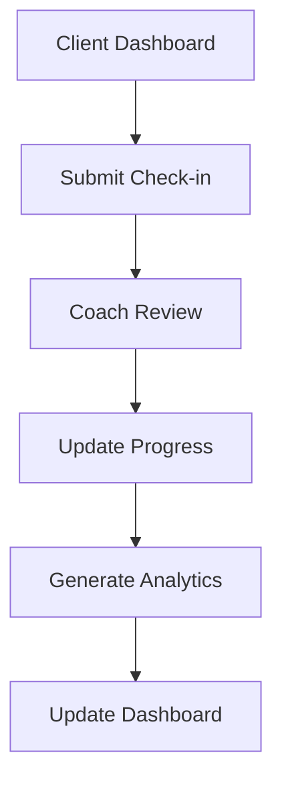
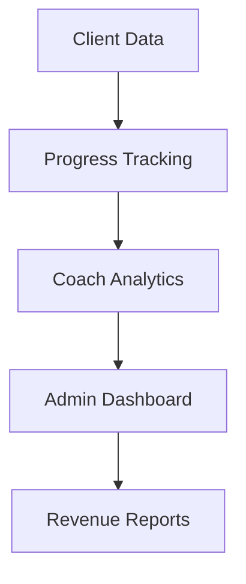
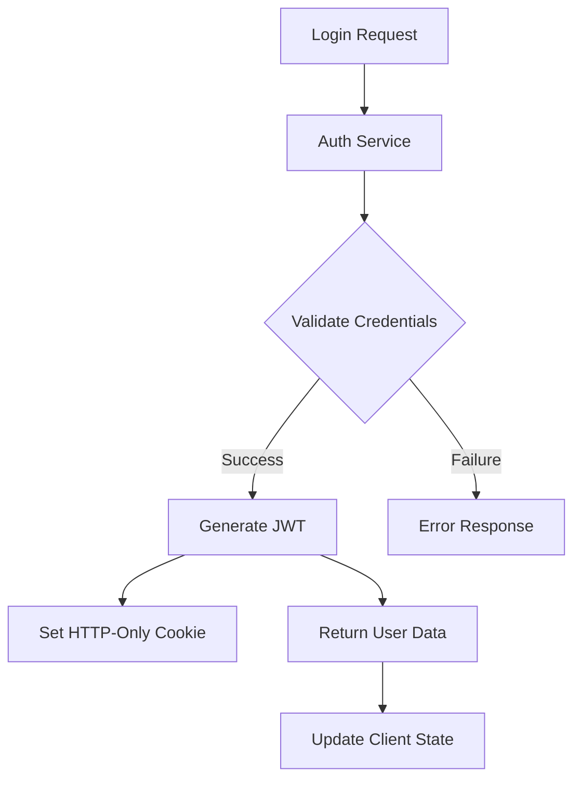
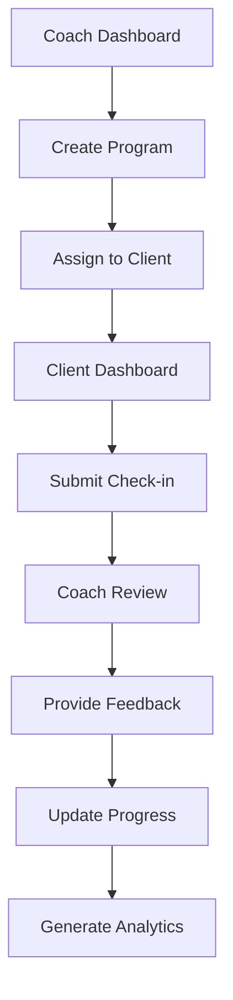
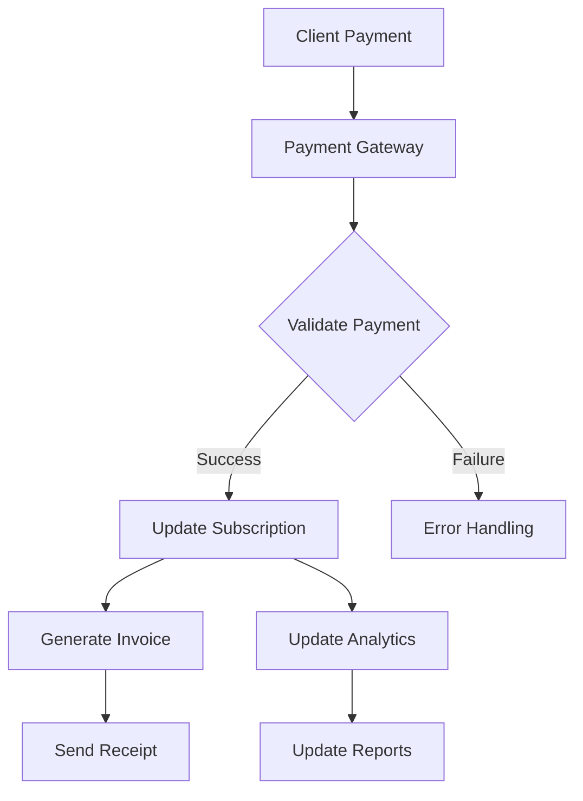

# Data Flow Documentation

## Overview
This document outlines the data flow and relationships between different parts of the application.

## Core Data Models

### User Flow
1. **Authentication**
   - User logs in → JWT token generated
   - Token used for authenticated requests
   - Role-based access control (admin/coach/client)

2. **Coach-Client Relationship**
   - Coach creates program → Client assigned
   - Client submits check-ins → Coach reviews
   - Coach provides feedback → Client receives updates

## Data Flow Diagrams

### Client Progress Flow


### Analytics Flow


## API Endpoints

### Public Routes
- `/api/coaches` - List coaches
- `/api/coaches/:id` - Coach details
- `/api/auth/login` - Authentication

### Protected Routes
- `/api/clients` - Client management
- `/api/analytics` - Analytics data
- `/api/forms/submit` - Form submissions

## Data Validation

### Client-Side
- Form validation using Zod
- Type checking with TypeScript
- Real-time feedback

### Server-Side
- Input sanitization
- Schema validation
- Error handling

## State Management

### Client State
- React Query for server state
- Context for global UI state
- Local storage for preferences

### Server State
- Firebase Firestore
- Real-time updates
- Offline support

## Testing Strategy

### Unit Tests
- Data transformations
- Utility functions
- Component logic

### Integration Tests
- API endpoints
- Authentication flow
- Data persistence

### E2E Tests
- Critical user flows
- Payment processing
- Form submissions

## Monitoring and Logging

### Performance Metrics
- Page load times
- API response times
- Database queries

### Error Tracking
- Client-side errors
- Server-side errors
- API failures

### Analytics
- User engagement
- Feature usage
- Conversion rates

## Security Measures

### Data Protection
- Encryption at rest
- Secure transmission
- Access control

### Authentication
- JWT tokens
- Session management
- Rate limiting

## Deployment Considerations

### Data Migration
- Version control
- Backward compatibility
- Rollback procedures

### Performance
- Caching strategy
- Database indexing
- Load balancing

## Maintenance

### Regular Tasks
- Data backups
- Performance monitoring
- Security updates

### Documentation
- API changes
- Schema updates
- New features

## Admin Dashboard Data Flows

### Analytics
- **Client Metrics** → **Client Profiles**
  - Client progress data
  - Session attendance
  - Goal completion rates
  - Engagement metrics

- **Revenue Analytics** → **Billing**
  - Transaction history
  - Revenue forecasts
  - Payment processing status
  - Subscription metrics

- **Coach Performance** → **Coach Profiles**
  - Session completion rates
  - Client satisfaction scores
  - Revenue generation
  - Booking rates

### User Management
- **Coach Profiles** → **Analytics**
  - Performance metrics
  - Client load
  - Revenue generation
  - Availability status

- **Client Profiles** → **Analytics**
  - Engagement metrics
  - Payment history
  - Session attendance
  - Progress tracking

### Billing & Payments
- **Payment History** → **Analytics**
  - Transaction records
  - Refund data
  - Payment methods
  - Processing status

- **Subscriptions** → **Client Profiles**
  - Plan details
  - Billing cycles
  - Payment status
  - Usage limits

### Security & Audit
- **Security Settings** → **Audit Logs**
  - Access attempts
  - Permission changes
  - Security events
  - System modifications

- **User Management** → **Security**
  - Permission levels
  - Access controls
  - Role assignments
  - Authentication status

## Coach Dashboard Data Flows

### Client Management
- **Client Profiles** → **Progress Tracking**
  - Personal information
  - Session history
  - Goals and milestones
  - Notes and feedback

### Program Management
- **Program Builder** → **Client Programs**
  - Exercise templates
  - Workout plans
  - Progress metrics
  - Customization options

## Client Dashboard Data Flows

### Progress Tracking
- **Check-ins** → **Coach Dashboard**
  - Progress updates
  - Measurement data
  - Goal tracking
  - Feedback submission

### Scheduling
- **Appointments** → **Coach Calendar**
  - Session bookings
  - Availability checks
  - Cancellations
  - Rescheduling

## Security Considerations

1. **Data Access Control**
   - Role-based access control (RBAC)
   - Data encryption in transit and at rest
   - Audit logging of all sensitive operations
   - Regular security reviews

2. **Payment Security**
   - PCI compliance for payment processing
   - Secure payment gateway integration
   - Transaction monitoring
   - Fraud detection systems

3. **Privacy Protection**
   - GDPR compliance
   - Data retention policies
   - Privacy settings management
   - Data export capabilities

## Performance Optimization

1. **Caching Strategy**
   - Redis caching for frequently accessed data
   - Browser caching for static assets
   - Query result caching
   - Session state management

2. **Database Optimization**
   - Indexed queries
   - Query optimization
   - Connection pooling
   - Regular maintenance

3. **API Performance**
   - Rate limiting
   - Response compression
   - Batch operations
   - Asynchronous processing

## Detailed Data Flows

### Authentication Flow


### Coach-Client Interaction Flow


### Payment Processing Flow


## Enhanced Security Measures

### Authentication & Authorization
1. **Multi-Factor Authentication (MFA)**
   - SMS/Email verification
   - Authenticator app support
   - Hardware key support (FIDO2)
   - Biometric authentication option

2. **Session Management**
   - JWT with short expiration
   - Refresh token rotation
   - Device fingerprinting
   - Concurrent session control
   - Session activity monitoring

3. **Access Control**
   - Role-based access (RBAC)
   - Attribute-based access (ABAC)
   - Resource-level permissions
   - IP-based restrictions
   - Time-based access rules

### Data Protection
1. **Encryption**
   - AES-256 for data at rest
   - TLS 1.3 for data in transit
   - End-to-end encryption for messages
   - Field-level encryption for sensitive data
   - Key rotation policies

2. **Data Sanitization**
   - Input validation
   - Output encoding
   - SQL injection prevention
   - XSS protection
   - CSRF protection

3. **Privacy Controls**
   - Data anonymization
   - Pseudonymization
   - Data masking
   - Consent management
   - Data retention policies

### Audit & Compliance
1. **Activity Logging**
   - User actions
   - System events
   - Security events
   - Data access logs
   - Change history

2. **Compliance Monitoring**
   - GDPR compliance
   - HIPAA compliance
   - PCI DSS compliance
   - SOC 2 compliance
   - Regular audits

## Component-Specific Data Flows

### Admin Dashboard
1. **Analytics Engine**
   ```mermaid
   graph TD
       A[Raw Data] --> B[Data Processing]
       B --> C[Aggregation]
       C --> D[Analytics Storage]
       D --> E[Dashboard Display]
       E --> F[Export Reports]
   ```

2. **User Management**
   ```mermaid
   graph TD
       A[User Data] --> B[Validation]
       B --> C[Role Assignment]
       C --> D[Permission Mapping]
       D --> E[Access Control]
       E --> F[Audit Logging]
   ```

### Coach Dashboard
1. **Program Management**
   ```mermaid
   graph TD
       A[Program Creation] --> B[Template Selection]
       B --> C[Customization]
       C --> D[Client Assignment]
       D --> E[Progress Tracking]
       E --> F[Analytics Update]
   ```

2. **Client Management**
   ```mermaid
   graph TD
       A[Client Data] --> B[Progress Monitoring]
       B --> C[Feedback System]
       C --> D[Goal Tracking]
       D --> E[Performance Analytics]
       E --> F[Report Generation]
   ```

### Client Dashboard
1. **Progress Tracking**
   ```mermaid
   graph TD
       A[Check-in Data] --> B[Data Validation]
       B --> C[Progress Calculation]
       C --> D[Goal Comparison]
       D --> E[Coach Notification]
       E --> F[Dashboard Update]
   ```

2. **Booking System**
   ```mermaid
   graph TD
       A[Availability Check] --> B[Slot Selection]
       B --> C[Payment Processing]
       C --> D[Calendar Update]
       D --> E[Notification System]
       E --> F[Reminder Setup]
   ```

## Performance Optimization Strategies

### Caching Architecture
1. **Multi-Level Caching**
   - Browser cache
   - CDN cache
   - Application cache
   - Database cache
   - Distributed cache (Redis)

2. **Cache Invalidation**
   - Time-based expiration
   - Event-based invalidation
   - Version tagging
   - Selective purging
   - Cache warming

### API Optimization
1. **Request Handling**
   - Rate limiting
   - Request batching
   - Query optimization
   - Response compression
   - Connection pooling

2. **Data Loading**
   - Lazy loading
   - Infinite scrolling
   - Pagination
   - Prefetching
   - Background loading 