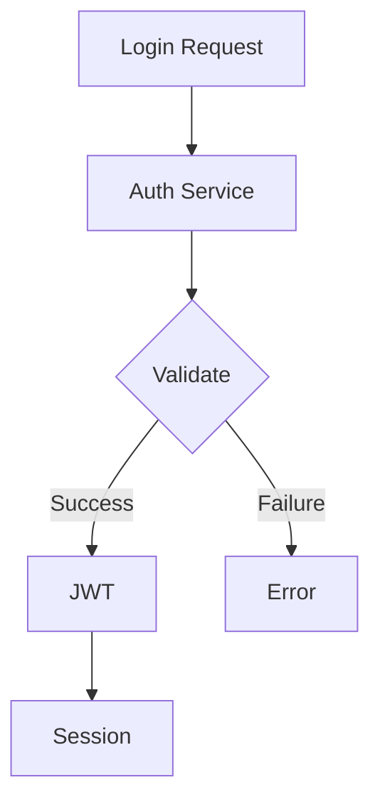
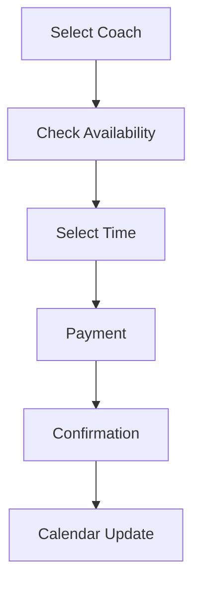
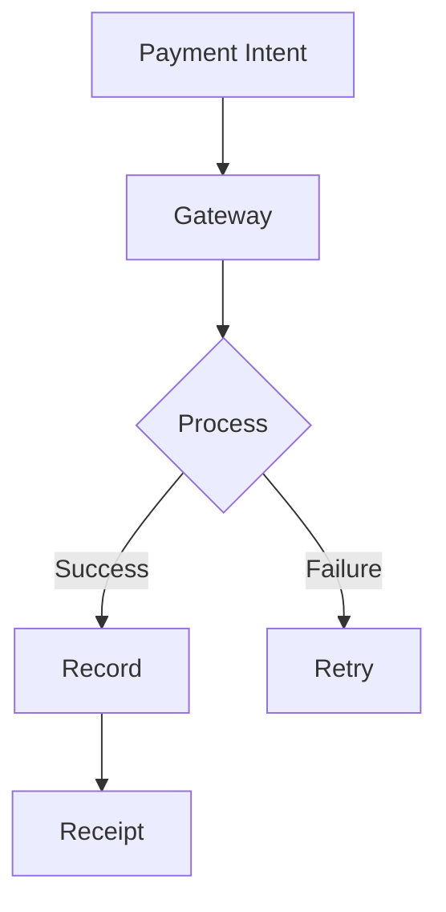

# Comprehensive Site Map

## 🏠 Home (/)
Main landing page for all users
- **Data Flow**: User preferences, Coach listings
- **Connections**: Coach Search, About Us, Contact
- **Status**: Completed
- **Security**: Public access, Rate limiting

### 🔍 Coach Search (/search)
Search and filter coaches by specialty
- **Data Flow**: Search parameters, Filter settings, Coach data
- **Connections**: Coach Profile, Search Filters
- **Status**: Completed
- **Security**: Public access, Query rate limiting

#### 🎯 Search Filters (/search/filters)
Advanced search filters and preferences
- **Data Flow**: Filter parameters, User preferences
- **Connections**: Coach Search results
- **Status**: Completed
- **Security**: Rate limiting, Input validation

### 👤 Coach Profile (/coach/[id])
Detailed coach profile and booking
- **Data Flow**: Coach details, Availability, Reviews
- **Connections**: Booking, Reviews, Coach Dashboard
- **Status**: Completed
- **Security**: Public read, Authenticated write

#### 📅 Booking (/coach/[id]/booking)
Schedule coaching sessions
- **Data Flow**: Calendar data, Payment info, Session details
- **Connections**: Payments, Schedule
- **Status**: Completed
- **Security**: Authenticated access, Payment encryption

#### ⭐ Reviews (/coach/[id]/reviews)
Client reviews and testimonials
- **Data Flow**: Review data, Ratings
- **Connections**: Client Profiles
- **Status**: Completed
- **Security**: Authenticated write, Public read

### ℹ️ About Us (/about)
Company information and mission
- **Data Flow**: Static content
- **Connections**: Contact
- **Status**: Completed
- **Security**: Public access

### 📞 Contact (/contact)
Contact information and support
- **Data Flow**: Contact form data
- **Connections**: Support system
- **Status**: Completed
- **Security**: Rate limiting, Spam protection

## 👑 Admin Dashboard (/admin)
Administrative control panel
- **Data Flow**: System-wide metrics, User data
- **Connections**: Analytics, Settings, Users, Coach Management, Billing, Reports
- **Status**: Completed
- **Security**: Admin access only, MFA required

### 📊 Analytics (/admin/analytics)
Performance metrics and analytics
- **Data Flow**: Usage metrics, Revenue data, Performance stats
- **Connections**: Client Metrics, Revenue Analytics, Coach Performance
- **Status**: In Progress
- **Security**: Admin access, Data encryption

#### 📈 Client Metrics (/admin/analytics/clients)
Client progress and engagement tracking
- **Data Flow**: Client activity data, Progress metrics
- **Connections**: Client Profiles, Progress Tracking
- **Status**: Planned
- **Security**: Admin access, Data anonymization

#### 💰 Revenue Analytics (/admin/analytics/revenue)
Financial metrics and forecasting
- **Data Flow**: Transaction data, Subscription metrics
- **Connections**: Billing, Payments, Subscriptions
- **Status**: Planned
- **Security**: Admin access, Financial data encryption

#### 🎯 Coach Performance (/admin/analytics/coaches)
Coach success and rating metrics
- **Data Flow**: Performance data, Client feedback
- **Connections**: Coach Profiles, Reviews
- **Status**: Planned
- **Security**: Admin access, Data privacy

### ⚙️ Settings (/admin/settings)
System configuration
- **Data Flow**: System settings, Configuration data
- **Connections**: Security, Notifications, Integrations
- **Status**: Completed
- **Security**: Admin access, Audit logging

#### 🔒 Security (/admin/settings/security)
Security settings and access control
- **Data Flow**: Security config, Access logs
- **Connections**: Users, Audit Logs
- **Status**: Completed
- **Security**: Admin access, Enhanced encryption

#### 🔔 Notifications (/admin/settings/notifications)
Notification management
- **Data Flow**: Notification templates, Delivery status
- **Connections**: Email Templates, Push Notifications
- **Status**: Completed
- **Security**: Admin access

#### 🔄 Integrations (/admin/settings/integrations)
Third-party service management
- **Data Flow**: Integration configs, API keys
- **Connections**: Payment Gateway, Email Service
- **Status**: Planned
- **Security**: Admin access, API key encryption

### 👥 User Management (/admin/users)
User administration
- **Data Flow**: User data, Permissions
- **Connections**: Coach Profiles, Client Profiles
- **Status**: Completed
- **Security**: Admin access, Data privacy

#### 👨‍🏫 Coach Profiles (/admin/users/coaches)
Coach account management
- **Data Flow**: Coach data, Verification status
- **Connections**: Coach Performance, Payments
- **Status**: Completed
- **Security**: Admin access, PII protection

#### 👥 Client Profiles (/admin/users/clients)
Client account management
- **Data Flow**: Client data, Subscription status
- **Connections**: Client Metrics, Payments
- **Status**: Completed
- **Security**: Admin access, PII protection

### 💳 Billing & Payments (/admin/billing)
Payment processing and management
- **Data Flow**: Transaction data, Payment status
- **Connections**: Revenue Analytics, User Profiles
- **Status**: In Progress
- **Security**: Admin access, PCI compliance

#### 💰 Payment History (/admin/billing/payments)
Transaction history and refunds
- **Data Flow**: Payment records, Refund data
- **Connections**: Revenue Analytics
- **Status**: Completed
- **Security**: Admin access, Financial encryption

#### 🔄 Subscriptions (/admin/billing/subscriptions)
Subscription plan management
- **Data Flow**: Subscription data, Plan configs
- **Connections**: Client Profiles, Revenue
- **Status**: In Progress
- **Security**: Admin access, Payment encryption

### 📋 Reports (/admin/reports)
System reporting
- **Data Flow**: Report data, Export configs
- **Connections**: Analytics, Billing, Users
- **Status**: Planned
- **Security**: Admin access, Data encryption

#### 📝 Audit Logs (/admin/reports/audit)
System activity tracking
- **Data Flow**: Activity logs, Security events
- **Connections**: Security
- **Status**: Planned
- **Security**: Admin access, Log integrity

#### 📊 Performance Reports (/admin/reports/performance)
Platform performance tracking
- **Data Flow**: Performance metrics, System stats
- **Connections**: Analytics
- **Status**: Planned
- **Security**: Admin access

## 👨‍🏫 Coach Dashboard (/coach/dashboard)
Coach-specific control panel
- **Data Flow**: Coach metrics, Client data
- **Connections**: Client Management, Programs
- **Status**: In Progress
- **Security**: Coach access only

### 👥 Client Management (/coach/dashboard/clients)
Client relationship management
- **Data Flow**: Client data, Progress data
- **Connections**: Client Profiles, Progress
- **Status**: In Progress
- **Security**: Coach access, Client privacy

#### 👤 Client Profiles (/coach/dashboard/clients/profiles)
Individual client management
- **Data Flow**: Client details, History
- **Connections**: Progress Tracking
- **Status**: Completed
- **Security**: Coach access, Data privacy

#### 📈 Progress Tracking (/coach/dashboard/clients/progress)
Client progress monitoring
- **Data Flow**: Progress metrics, Goals
- **Connections**: Analytics
- **Status**: In Progress
- **Security**: Coach access, Data privacy

### 📚 Programs (/coach/dashboard/programs)
Program management
- **Data Flow**: Program data, Templates
- **Connections**: Client Programs
- **Status**: Planned
- **Security**: Coach access

#### 🛠️ Program Builder (/coach/dashboard/programs/builder)
Create and customize programs
- **Data Flow**: Program templates, Custom content
- **Connections**: Templates
- **Status**: Planned
- **Security**: Coach access

#### 📑 Templates (/coach/dashboard/programs/templates)
Program template management
- **Data Flow**: Template data, Configurations
- **Connections**: Program Builder
- **Status**: Planned
- **Security**: Coach access

## 👤 Client Dashboard (/client/dashboard)
Client-specific control panel
- **Data Flow**: Progress data, Program access
- **Connections**: Programs, Check-ins, Schedule
- **Status**: In Progress
- **Security**: Client access only

### ✅ Check-ins (/client/dashboard/checkins)
Progress reporting
- **Data Flow**: Check-in data, Progress updates
- **Connections**: Progress Tracking
- **Status**: In Progress
- **Security**: Client access

### 📈 Progress (/client/dashboard/progress)
Progress visualization
- **Data Flow**: Progress metrics, Goals
- **Connections**: Check-ins, Coach Review
- **Status**: In Progress
- **Security**: Client access

### 📅 Schedule (/client/dashboard/schedule)
Session scheduling
- **Data Flow**: Calendar data, Availability
- **Connections**: Booking, Payments
- **Status**: Completed
- **Security**: Client access

### 💳 Payments (/client/dashboard/payments)
Payment management
- **Data Flow**: Payment history, Invoices
- **Connections**: Billing, Subscriptions
- **Status**: Completed
- **Security**: Client access, Payment encryption

## Data Flow Patterns

### Authentication Flow

### Booking Flow

### Payment Flow

## Security Layers

### Authentication
- JWT with refresh tokens
- MFA for admin/coach access
- Session management
- Device tracking

### Data Protection
- End-to-end encryption
- Field-level encryption
- Data masking
- Access logging

### Compliance
- GDPR compliance
- HIPAA standards
- PCI DSS for payments
- Regular security audits 