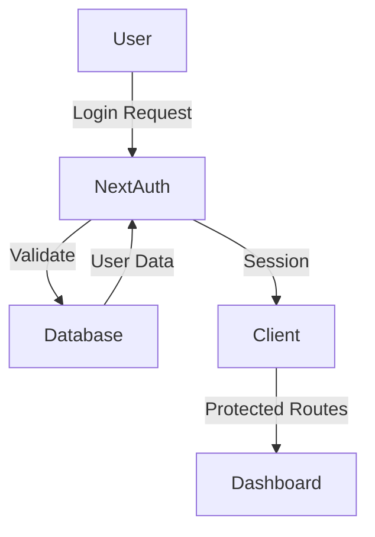
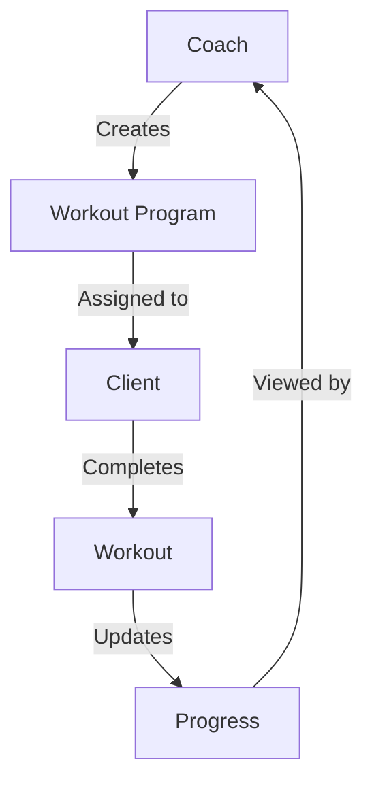
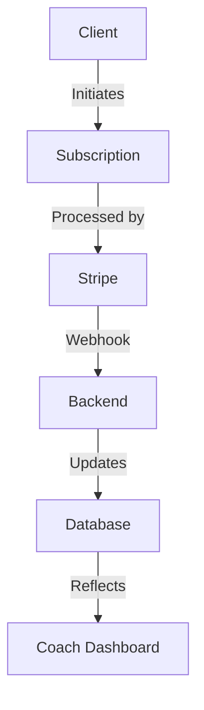

# Health & Fitness Platform

## Project Overview
A modern health and fitness platform that connects coaches with clients, enabling personalized training programs, progress tracking, and seamless communication.

## Tech Stack
- **Frontend**: Next.js 14 with App Router
- **Backend**: Next.js API Routes
- **Database**: PostgreSQL with Prisma ORM
- **Authentication**: NextAuth.js
- **Styling**: Tailwind CSS
- **UI Components**: Custom components with Radix UI primitives
- **State Management**: React hooks
- **Payment Processing**: Stripe

## Core Features

### Authentication & User Management
- Role-based access (Admin, Coach, Client)
- Secure authentication with NextAuth.js
- Last login tracking for both coaches and clients
- Profile management for all user types

### Dashboard Features
#### Admin Dashboard
- Coach management
- Client overview
- Revenue tracking
- System analytics
- User activity monitoring

#### Coach Dashboard
- Client management
- Progress tracking
- Revenue analytics
- Client communication
- Workout program creation

#### Client Dashboard
- Progress tracking
- Workout viewing
- Coach communication
- Subscription management
- Goal setting

## Data Flow

### Authentication Flow


### Coach-Client Interaction Flow


### Payment Flow


## Page Layouts

### Admin Dashboard Layout
```
+------------------+----------------------------------+
|                  |                                  |
|    Sidebar       |           Header                 |
|  - Dashboard     |  - Profile                      |
|  - Coaches       |  - Notifications                 |
|  - Clients       |  - Settings                     |
|  - Analytics     |                                  |
|                  |                                  |
+------------------+----------------------------------+
|                  |                                  |
|                  |    Main Content Area             |
|                  |  - Statistics Cards              |
|                  |  - Recent Activity Table         |
|                  |  - Revenue Chart                 |
|                  |                                  |
+------------------+----------------------------------+
```

### Coach Dashboard Layout
```
+------------------+----------------------------------+
|                  |                                  |
|    Sidebar       |           Header                 |
|  - Dashboard     |  - Profile                      |
|  - Clients       |  - Messages                     |
|  - Workouts      |  - Revenue                      |
|  - Analytics     |                                  |
|                  |                                  |
+------------------+----------------------------------+
|                  |                                  |
|                  |    Main Content Area             |
|                  |  - Client Overview Cards         |
|                  |  - Recent Check-ins              |
|                  |  - Revenue Summary               |
|                  |                                  |
+------------------+----------------------------------+
```

### Client Dashboard Layout
```
+------------------+----------------------------------+
|                  |                                  |
|    Sidebar       |           Header                 |
|  - Dashboard     |  - Profile                      |
|  - Workouts      |  - Messages                     |
|  - Progress      |  - Subscription                 |
|  - Goals         |                                  |
|                  |                                  |
+------------------+----------------------------------+
|                  |                                  |
|                  |    Main Content Area             |
|                  |  - Today's Workout               |
|                  |  - Progress Charts               |
|                  |  - Recent Activity               |
|                  |                                  |
+------------------+----------------------------------+
```

### Responsive Breakpoints
- Mobile: < 640px
- Tablet: 640px - 1024px
- Desktop: > 1024px

### Component Layout Rules
1. **Header**
   - Fixed position
   - Height: 64px
   - Contains navigation and user controls
   - Responsive menu on mobile

2. **Sidebar**
   - Width: 256px (desktop)
   - Collapsible on mobile
   - Fixed position on desktop
   - Contains main navigation

3. **Main Content**
   - Padding: 24px
   - Max-width: 1200px
   - Responsive grid system
   - Card-based layout

4. **Cards**
   - Border radius: 8px
   - Shadow: 0 1px 3px rgba(0,0,0,0.1)
   - Padding: 16px
   - Margin: 16px

### Database Schema
```prisma
model Coach {
  id            String         @id @default(cuid())
  email         String         @unique
  name          String
  createdAt     DateTime       @default(now())
  updatedAt     DateTime       @updatedAt
  lastLoginAt   DateTime?
  clients       Client[]
  stripeConnect StripeConnect?
}

model Client {
  id              String           @id @default(cuid())
  name            String
  email           String
  stripeCustomerId String          @unique
  coachId         String
  coach           Coach            @relation(fields: [coachId], references: [id])
  subscriptions   Subscription[]
  createdAt       DateTime         @default(now())
  updatedAt       DateTime         @updatedAt
  lastLoginAt     DateTime?
}

model Subscription {
  id                String            @id @default(cuid())
  stripeSubscriptionId String         @unique
  clientId          String
  client            Client            @relation(fields: [clientId], references: [id])
  status            SubscriptionStatus
  planName          String
  amount            Float
  currency          String
  currentPeriodEnd  DateTime
  cancelAtPeriodEnd Boolean          @default(false)
  createdAt         DateTime         @default(now())
  updatedAt         DateTime         @updatedAt
}
```

## Component Structure

### Core Components
- `LastLoginBadge`: Displays user's last login time
- `Button`: Reusable button component with variants
- `Input`: Form input component
- `Card`: Container component for content sections

### Layout Components
- `DashboardLayout`: Main dashboard wrapper
- `Sidebar`: Navigation sidebar
- `Header`: Top navigation bar

## Development Guidelines

### Code Style
- Use TypeScript for type safety
- Follow ESLint and Prettier configurations
- Use functional components with hooks
- Implement proper error handling
- Write meaningful comments for complex logic

### File Structure
```
src/
├── app/
│   ├── (auth)/
│   ├── (dashboard)/
│   │   ├── admin/
│   │   ├── coach/
│   │   └── client/
│   └── api/
├── components/
│   ├── ui/
│   └── dashboard/
├── lib/
│   ├── prisma/
│   └── services/
└── types/
```

### State Management
- Use React hooks for local state
- Implement proper loading states
- Handle error states gracefully
- Cache data appropriately

### API Routes
- Implement proper error handling
- Use appropriate HTTP methods
- Validate request data
- Return consistent response formats

## Getting Started

### Prerequisites
- Node.js 18+
- PostgreSQL
- Stripe account
- Environment variables set up

### Installation
1. Clone the repository
2. Install dependencies: `npm install`
3. Set up environment variables
4. Run database migrations: `npx prisma migrate dev`
5. Start development server: `npm run dev`

### Environment Variables
```env
DATABASE_URL=
NEXTAUTH_SECRET=
NEXTAUTH_URL=
STRIPE_SECRET_KEY=
STRIPE_WEBHOOK_SECRET=
```

## Development Workflow

### Git Workflow
1. Create feature branch from main
2. Make changes and commit with meaningful messages
3. Push changes and create pull request
4. Review and merge to main

### Testing
- Write unit tests for critical functions
- Test API routes
- Test user flows
- Implement E2E tests for critical paths

### Deployment
- Use Vercel for deployment
- Set up proper environment variables
- Configure database backups
- Monitor error tracking

## Future Enhancements
- Mobile app development
- Advanced analytics
- AI-powered workout recommendations
- Social features
- Integration with fitness devices

## Contributing
1. Fork the repository
2. Create feature branch
3. Commit changes
4. Push to branch
5. Create pull request

## License
MIT License 